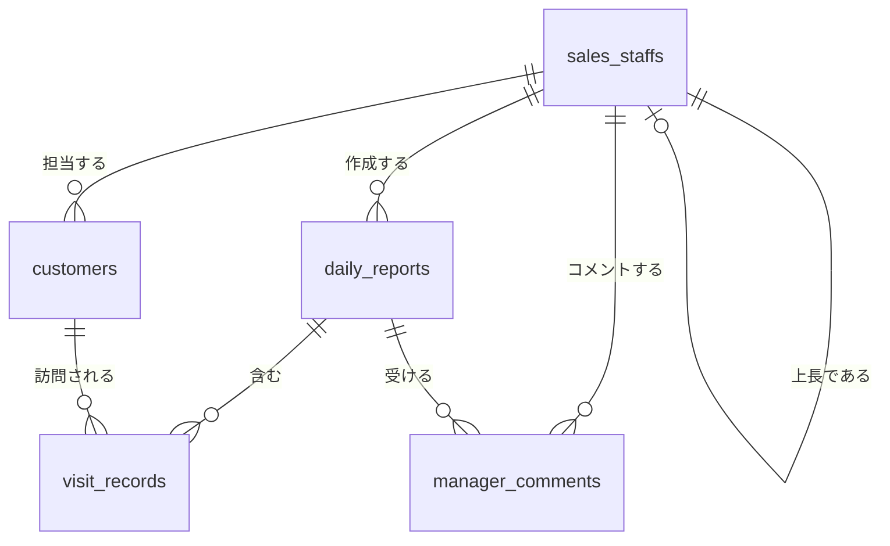

# 営業日報システム (Sales Daily Report System)

## プロジェクト概要

営業担当者が日々の訪問活動を報告し、上長がコメントを行うための営業日報管理システム。

### 主要機能

- 営業担当者が顧客訪問記録を含む日報を作成・提出する（1日1日報、訪問記録は複数可）
- 課題・相談（Problem）と明日やること（Plan）を記入する
- 上長が日報に対してコメントを投稿する
- 顧客マスタ・営業マスタの管理

## 仕様書一覧

全ての仕様書は `docs/` ディレクトリに格納されている。

| ドキュメント | ファイル | 概要 |
|-------------|---------|------|
| 画面定義書 | [docs/営業日報システム_画面定義書.md](docs/営業日報システム_画面定義書.md) | 全8画面のワイヤーフレーム・項目定義・イベント処理・バリデーション・画面遷移図（Mermaid） |
| API仕様書 | [docs/営業日報システム_API仕様書.md](docs/営業日報システム_API仕様書.md) | REST API 全21エンドポイントのリクエスト/レスポンス定義・JWT認証・エラーコード一覧 |
| テスト仕様書 | [docs/営業日報システム_テスト仕様書.md](docs/営業日報システム_テスト仕様書.md) | 全150件のテストケース（機能・バリデーション・権限・API） |

## データモデル（ER図）

### テーブル一覧

| テーブル名 | 論理名 | 概要 |
|-----------|--------|------|
| sales_staffs | 営業マスタ | 営業担当者情報。自己参照で上長関係を管理 |
| customers | 顧客マスタ | 顧客情報。担当営業を持つ |
| daily_reports | 日報 | 日報本体。営業1人につき1日1件（UNIQUE制約） |
| visit_records | 訪問記録 | 日報に紐づく訪問記録。1日報に複数件 |
| manager_comments | 上長コメント | 日報に対する上長のコメント |

## 画面一覧

| 画面ID | 画面名 | URL | 権限 |
|--------|--------|-----|------|
| SCR-01 | ログイン画面 | /login | 全ユーザー |
| SCR-02 | 日報一覧画面 | /reports | 全ログインユーザー |
| SCR-03 | 日報作成・編集画面 | /reports/new, /reports/:id/edit | 営業担当者 |
| SCR-04 | 日報詳細画面 | /reports/:id | 本人・上長 |
| SCR-05 | 顧客マスタ一覧画面 | /customers | 全ログインユーザー |
| SCR-06 | 顧客マスタ登録・編集画面 | /customers/new, /customers/:id/edit | 管理者・営業担当者 |
| SCR-07 | 営業マスタ一覧画面 | /staffs | 管理者 |
| SCR-08 | 営業マスタ登録・編集画面 | /staffs/new, /staffs/:id/edit | 管理者 |

## API エンドポイント一覧

ベースURL: `/api/v1`　認証方式: Bearer Token（JWT）

| メソッド | エンドポイント | 概要 | 権限 |
|---------|---------------|------|------|
| POST | /auth/login | ログイン | 全員 |
| POST | /auth/logout | ログアウト | 認証済 |
| GET | /auth/me | ログインユーザー情報取得 | 認証済 |
| GET | /reports | 日報一覧取得 | 認証済 |
| GET | /reports/:id | 日報詳細取得 | 本人・上長 |
| POST | /reports | 日報作成 | 営業担当 |
| PUT | /reports/:id | 日報更新 | 本人 |
| DELETE | /reports/:id | 日報削除 | 本人 |
| GET | /reports/:id/visits | 訪問記録一覧取得 | 本人・上長 |
| POST | /reports/:id/visits | 訪問記録追加 | 本人 |
| PUT | /reports/:id/visits/:vid | 訪問記録更新 | 本人 |
| DELETE | /reports/:id/visits/:vid | 訪問記録削除 | 本人 |
| GET | /reports/:id/comments | コメント一覧取得 | 本人・上長 |
| POST | /reports/:id/comments | コメント投稿 | 上長 |
| GET | /customers | 顧客一覧取得 | 認証済 |
| GET | /customers/:id | 顧客詳細取得 | 認証済 |
| POST | /customers | 顧客登録 | 管理者・営業 |
| PUT | /customers/:id | 顧客更新 | 管理者・営業 |
| DELETE | /customers/:id | 顧客削除 | 管理者 |
| GET | /staffs | 営業一覧取得 | 管理者 |
| GET | /staffs/:id | 営業詳細取得 | 管理者 |
| POST | /staffs | 営業登録 | 管理者 |
| PUT | /staffs/:id | 営業更新 | 管理者 |
| DELETE | /staffs/:id | 営業削除 | 管理者 |

## ビジネスルール

- 1人の営業につき1日1件の日報のみ作成可能
- 1つの日報に複数の訪問記録を登録可能
- コメントは上長（manager）のみ投稿可能
- 営業マスタは自己参照で上長関係を管理
- 顧客には主担当の営業が割り当てられる
- 提出済みの日報は削除不可（下書きのみ削除可）
- 訪問記録・日報が存在するマスタデータは削除不可
