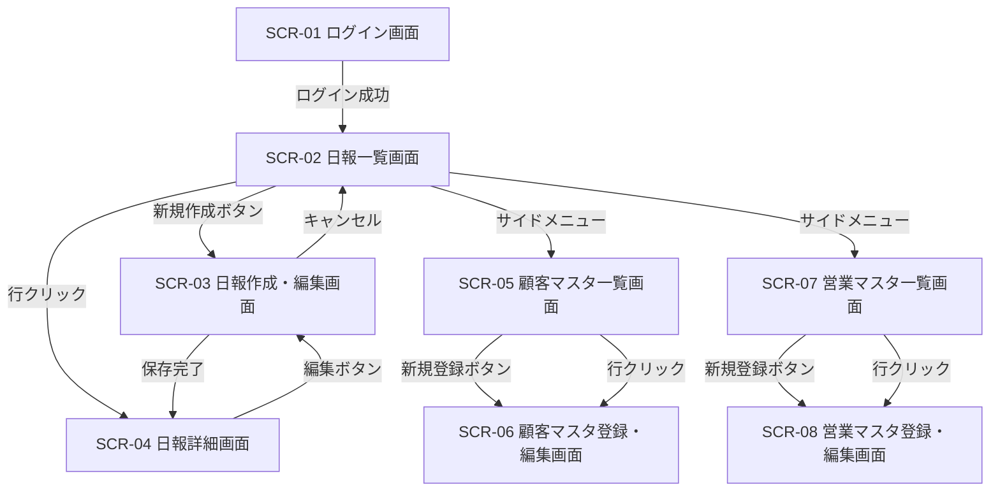

# 営業日報システム 画面定義書

## 目次

1. [画面一覧](#1-画面一覧)
2. [画面遷移図](#2-画面遷移図)
3. [SCR-01 ログイン画面](#scr-01-ログイン画面)
4. [SCR-02 日報一覧画面](#scr-02-日報一覧画面)
5. [SCR-03 日報作成・編集画面](#scr-03-日報作成編集画面)
6. [SCR-04 日報詳細画面](#scr-04-日報詳細画面)
7. [SCR-05 顧客マスタ一覧画面](#scr-05-顧客マスタ一覧画面)
8. [SCR-06 顧客マスタ登録・編集画面](#scr-06-顧客マスタ登録編集画面)
9. [SCR-07 営業マスタ一覧画面](#scr-07-営業マスタ一覧画面)
10. [SCR-08 営業マスタ登録・編集画面](#scr-08-営業マスタ登録編集画面)

---

## 1. 画面一覧

| 画面ID | 画面名 | 概要 | 権限 |
|--------|--------|------|------|
| SCR-01 | ログイン画面 | システムへのログイン | 全ユーザー |
| SCR-02 | 日報一覧画面 | 日報の検索・一覧表示 | 全ログインユーザー |
| SCR-03 | 日報作成・編集画面 | 日報の新規作成・編集 | 営業担当者 |
| SCR-04 | 日報詳細画面 | 日報の閲覧・上長コメント | 全ログインユーザー |
| SCR-05 | 顧客マスタ一覧画面 | 顧客の検索・一覧表示 | 全ログインユーザー |
| SCR-06 | 顧客マスタ登録・編集画面 | 顧客の新規登録・編集 | 管理者・営業担当者 |
| SCR-07 | 営業マスタ一覧画面 | 営業担当者の一覧表示 | 管理者 |
| SCR-08 | 営業マスタ登録・編集画面 | 営業担当者の登録・編集 | 管理者 |

---

## 2. 画面遷移図



---

## SCR-01 ログイン画面

### 基本情報

| 項目 | 内容 |
|------|------|
| 画面ID | SCR-01 |
| 画面名 | ログイン画面 |
| URL | `/login` |
| 認証 | 不要 |

### ワイヤーフレーム

```
+--------------------------------------------------+
|              営業日報システム                       |
|                                                    |
|         +----------------------------+             |
|         |                            |             |
|         |  メールアドレス             |             |
|         |  [________________________]|             |
|         |                            |             |
|         |  パスワード                 |             |
|         |  [________________________]|             |
|         |                            |             |
|         |  [      ログイン        ]  |             |
|         |                            |             |
|         +----------------------------+             |
|                                                    |
+--------------------------------------------------+
```

### 項目定義

| # | 項目名 | 種別 | 必須 | 備考 |
|---|--------|------|------|------|
| 1 | メールアドレス | テキスト入力 | ○ | email形式バリデーション |
| 2 | パスワード | パスワード入力 | ○ | 8文字以上 |
| 3 | ログインボタン | ボタン | - | 認証処理実行 |

### イベント・処理

| # | イベント | 処理内容 |
|---|---------|---------|
| E-01 | ログインボタン押下 | メールアドレス・パスワードで認証。成功時 → SCR-02へ遷移。失敗時 → エラーメッセージ表示 |

### バリデーション

| # | 対象 | ルール | エラーメッセージ |
|---|------|--------|----------------|
| V-01 | メールアドレス | 必須・email形式 | 「正しいメールアドレスを入力してください」 |
| V-02 | パスワード | 必須・8文字以上 | 「パスワードは8文字以上で入力してください」 |
| V-03 | 認証 | DB照合 | 「メールアドレスまたはパスワードが正しくありません」 |

---

## SCR-02 日報一覧画面

### 基本情報

| 項目 | 内容 |
|------|------|
| 画面ID | SCR-02 |
| 画面名 | 日報一覧画面 |
| URL | `/reports` |
| 認証 | 必要 |

### ワイヤーフレーム

```
+------------------------------------------------------------------+
| [LOGO] 営業日報システム          田中太郎 ▼  [ログアウト]          |
+----------+-------------------------------------------------------+
| メニュー  |  日報一覧                              [+ 新規作成]   |
|           |-------------------------------------------------------|
| > 日報    |  検索条件                                              |
|   顧客   |  報告日: [____/__/__] 〜 [____/__/__]                  |
|   営業   |  営業担当: [▼ 選択_________]                           |
|           |  顧客名:  [________________]                           |
|           |                              [検索] [クリア]           |
|           |-------------------------------------------------------|
|           |  報告日     | 営業担当 | 訪問件数 | ステータス | 操作  |
|           |-------------|----------|----------|-----------|-------|
|           |  2026/03/01 | 田中太郎 | 3件      | コメント済 | 詳細  |
|           |  2026/03/01 | 佐藤花子 | 2件      | 未確認    | 詳細  |
|           |  2026/02/28 | 田中太郎 | 1件      | コメント済 | 詳細  |
|           |  ...        | ...      | ...      | ...       | ...   |
|           |-------------------------------------------------------|
|           |  << < 1 2 3 ... 10 > >>           全150件 (20件/ページ)|
+----------+-------------------------------------------------------+
```

### 項目定義

#### 検索条件エリア

| # | 項目名 | 種別 | 必須 | 備考 |
|---|--------|------|------|------|
| 1 | 報告日（From） | 日付入力 | - | カレンダーピッカー |
| 2 | 報告日（To） | 日付入力 | - | カレンダーピッカー |
| 3 | 営業担当 | セレクトボックス | - | 営業マスタから取得。上長は部下のみ表示 |
| 4 | 顧客名 | テキスト入力 | - | 部分一致検索 |
| 5 | 検索ボタン | ボタン | - | 検索実行 |
| 6 | クリアボタン | ボタン | - | 検索条件リセット |

#### 一覧エリア

| # | 項目名 | 種別 | 備考 |
|---|--------|------|------|
| 7 | 報告日 | テキスト（表示のみ） | YYYY/MM/DD形式 |
| 8 | 営業担当 | テキスト（表示のみ） | 営業マスタの氏名 |
| 9 | 訪問件数 | テキスト（表示のみ） | 訪問記録の件数 |
| 10 | ステータス | バッジ | 「未確認」「コメント済」 |
| 11 | 詳細リンク | リンク | SCR-04へ遷移 |
| 12 | 新規作成ボタン | ボタン | SCR-03へ遷移 |

### イベント・処理

| # | イベント | 処理内容 |
|---|---------|---------|
| E-01 | 画面初期表示 | ログインユーザーの当月の日報を表示。上長の場合は部下全員分を表示 |
| E-02 | 検索ボタン押下 | 検索条件に合致する日報を取得し一覧表示 |
| E-03 | クリアボタン押下 | 検索条件を初期状態に戻す |
| E-04 | 詳細リンク押下 | SCR-04（日報詳細画面）へ遷移 |
| E-05 | 新規作成ボタン押下 | SCR-03（日報作成・編集画面）へ遷移 |
| E-06 | ページング操作 | 指定ページのデータを取得し表示 |

---

## SCR-03 日報作成・編集画面

### 基本情報

| 項目 | 内容 |
|------|------|
| 画面ID | SCR-03 |
| 画面名 | 日報作成・編集画面 |
| URL | `/reports/new` `/reports/:id/edit` |
| 認証 | 必要（営業担当者本人のみ） |

### ワイヤーフレーム

```
+------------------------------------------------------------------+
| [LOGO] 営業日報システム          田中太郎 ▼  [ログアウト]          |
+----------+-------------------------------------------------------+
| メニュー  |  日報作成                                              |
|           |-------------------------------------------------------|
|           |                                                        |
|           |  報告日: [2026/03/02]                                  |
|           |                                                        |
|           |  ── 訪問記録 ─────────────────── [+ 訪問先を追加]  ── |
|           |                                                        |
|           |  訪問先 1                                              |
|           |  ┌────────────────────────────────────────────┐        |
|           |  │ 顧客名: [▼ 株式会社ABC________]  [×削除]   │        |
|           |  │ 訪問内容:                                   │        |
|           |  │ [                                          ]│        |
|           |  │ [   新製品の提案を実施。担当者は前向き。    ]│        |
|           |  │ [   来週見積もりを提出予定。                ]│        |
|           |  │ [                                          ]│        |
|           |  └────────────────────────────────────────────┘        |
|           |                                                        |
|           |  訪問先 2                                              |
|           |  ┌────────────────────────────────────────────┐        |
|           |  │ 顧客名: [▼ 株式会社DEF________]  [×削除]   │        |
|           |  │ 訪問内容:                                   │        |
|           |  │ [                                          ]│        |
|           |  │ [   定期フォロー訪問。特に問題なし。        ]│        |
|           |  │ [                                          ]│        |
|           |  └────────────────────────────────────────────┘        |
|           |                                                        |
|           |  ── 課題・相談（Problem） ─────────────────────────── |
|           |  [                                                ]    |
|           |  [  株式会社ABCの見積もり金額について上長に相談     ]    |
|           |  [  したい。競合他社の価格が判明し、調整が必要。   ]    |
|           |  [                                                ]    |
|           |                                                        |
|           |  ── 明日やること（Plan） ──────────────────────────── |
|           |  [                                                ]    |
|           |  [  ・株式会社ABCへ見積書作成                       ]    |
|           |  [  ・株式会社GHIへ初回訪問                         ]    |
|           |  [                                                ]    |
|           |                                                        |
|           |          [キャンセル]    [下書き保存]    [  提出  ]     |
|           |                                                        |
+----------+-------------------------------------------------------+
```

### 項目定義

| # | 項目名 | 種別 | 必須 | 備考 |
|---|--------|------|------|------|
| 1 | 報告日 | 日付入力 | ○ | デフォルト：当日。過去日付も選択可 |
| 2 | 訪問先を追加ボタン | ボタン | - | 訪問記録ブロックを動的追加 |
| 3 | 顧客名 | セレクトボックス（検索付き） | ○ | 顧客マスタから取得。インクリメンタル検索対応 |
| 4 | 訪問内容 | テキストエリア | ○ | 最大2000文字 |
| 5 | 削除ボタン（×） | ボタン | - | 該当の訪問記録ブロックを削除 |
| 6 | 課題・相談（Problem） | テキストエリア | - | 最大2000文字 |
| 7 | 明日やること（Plan） | テキストエリア | - | 最大2000文字 |
| 8 | キャンセルボタン | ボタン | - | SCR-02へ遷移（確認ダイアログ表示） |
| 9 | 下書き保存ボタン | ボタン | - | 下書きステータスで保存 |
| 10 | 提出ボタン | ボタン | - | 提出ステータスで保存 |

### イベント・処理

| # | イベント | 処理内容 |
|---|---------|---------|
| E-01 | 画面初期表示（新規） | 報告日に当日をセット。訪問記録ブロックを1件表示 |
| E-02 | 画面初期表示（編集） | 既存データを各項目にセット |
| E-03 | 訪問先を追加ボタン押下 | 訪問記録ブロックを1件追加 |
| E-04 | 削除ボタン（×）押下 | 該当訪問記録ブロックを削除。最低1件は残す |
| E-05 | 下書き保存ボタン押下 | バリデーション（緩い）→ ステータス「下書き」で保存 → SCR-04へ |
| E-06 | 提出ボタン押下 | バリデーション（厳密）→ ステータス「提出済」で保存 → SCR-04へ |
| E-07 | キャンセルボタン押下 | 確認ダイアログ「入力内容が破棄されます。よろしいですか？」→ SCR-02へ |

### バリデーション

| # | 対象 | ルール | エラーメッセージ |
|---|------|--------|----------------|
| V-01 | 報告日 | 必須 | 「報告日を入力してください」 |
| V-02 | 報告日 | 同一営業・同一日の日報が存在しない | 「この日付の日報は既に存在します」 |
| V-03 | 顧客名 | 必須（提出時） | 「訪問先の顧客を選択してください」 |
| V-04 | 訪問内容 | 必須（提出時）・2000文字以内 | 「訪問内容を入力してください」 |
| V-05 | 訪問記録 | 提出時1件以上 | 「訪問記録を1件以上登録してください」 |
| V-06 | 課題・相談 | 2000文字以内 | 「2000文字以内で入力してください」 |
| V-07 | 明日やること | 2000文字以内 | 「2000文字以内で入力してください」 |

---

## SCR-04 日報詳細画面

### 基本情報

| 項目 | 内容 |
|------|------|
| 画面ID | SCR-04 |
| 画面名 | 日報詳細画面 |
| URL | `/reports/:id` |
| 認証 | 必要（本人・上長のみ） |

### ワイヤーフレーム

```
+------------------------------------------------------------------+
| [LOGO] 営業日報システム          山田部長 ▼  [ログアウト]          |
+----------+-------------------------------------------------------+
| メニュー  |  日報詳細                      [一覧へ戻る] [編集]     |
|           |-------------------------------------------------------|
|           |                                                        |
|           |  報告日: 2026/03/02        営業担当: 田中太郎           |
|           |  ステータス: [提出済]                                   |
|           |                                                        |
|           |  ── 訪問記録 ────────────────────────────────────────  |
|           |                                                        |
|           |  1. 株式会社ABC                                        |
|           |     新製品の提案を実施。担当者は前向き。                 |
|           |     来週見積もりを提出予定。                             |
|           |                                                        |
|           |  2. 株式会社DEF                                        |
|           |     定期フォロー訪問。特に問題なし。                     |
|           |                                                        |
|           |  ── 課題・相談（Problem） ─────────────────────────── |
|           |  株式会社ABCの見積もり金額について上長に相談              |
|           |  したい。競合他社の価格が判明し、調整が必要。             |
|           |                                                        |
|           |  ── 明日やること（Plan） ──────────────────────────── |
|           |  ・株式会社ABCへ見積書作成                               |
|           |  ・株式会社GHIへ初回訪問                                 |
|           |                                                        |
|           |  ── 上長コメント ────────────────────────────────────  |
|           |                                                        |
|           |  ┌─────────────────────────────────────────────┐       |
|           |  │ 山田部長  2026/03/02 18:30                  │       |
|           |  │ ABC社の見積もりは15%引きまでOKです。         │       |
|           |  │ 明日の訪問頑張ってください。                  │       |
|           |  └─────────────────────────────────────────────┘       |
|           |                                                        |
|           |  コメント入力（上長のみ表示）:                          |
|           |  [                                                ]    |
|           |  [                                                ]    |
|           |                                    [コメント投稿]      |
|           |                                                        |
+----------+-------------------------------------------------------+
```

### 項目定義

#### 日報表示エリア

| # | 項目名 | 種別 | 備考 |
|---|--------|------|------|
| 1 | 報告日 | テキスト（表示のみ） | YYYY/MM/DD形式 |
| 2 | 営業担当 | テキスト（表示のみ） | 営業マスタの氏名 |
| 3 | ステータス | バッジ | 下書き / 提出済 / コメント済 |
| 4 | 訪問記録一覧 | リスト（表示のみ） | 顧客名＋訪問内容 |
| 5 | 課題・相談 | テキスト（表示のみ） | |
| 6 | 明日やること | テキスト（表示のみ） | |

#### コメントエリア

| # | 項目名 | 種別 | 必須 | 備考 |
|---|--------|------|------|------|
| 7 | コメント一覧 | リスト（表示のみ） | - | コメント者名・日時・本文 |
| 8 | コメント入力 | テキストエリア | ○ | 上長のみ表示。最大1000文字 |
| 9 | コメント投稿ボタン | ボタン | - | 上長のみ表示 |
| 10 | 一覧へ戻るボタン | ボタン | - | SCR-02へ遷移 |
| 11 | 編集ボタン | ボタン | - | 本人のみ表示。SCR-03へ遷移 |

### イベント・処理

| # | イベント | 処理内容 |
|---|---------|---------|
| E-01 | 画面初期表示 | 日報データ・訪問記録・コメント一覧を取得し表示 |
| E-02 | コメント投稿ボタン押下 | コメントを保存。日報ステータスを「コメント済」に更新。コメント一覧を再描画 |
| E-03 | 編集ボタン押下 | SCR-03（編集モード）へ遷移 |
| E-04 | 一覧へ戻るボタン押下 | SCR-02へ遷移 |

### バリデーション

| # | 対象 | ルール | エラーメッセージ |
|---|------|--------|----------------|
| V-01 | コメント入力 | 必須・1000文字以内 | 「コメントを入力してください」 |

---

## SCR-05 顧客マスタ一覧画面

### 基本情報

| 項目 | 内容 |
|------|------|
| 画面ID | SCR-05 |
| 画面名 | 顧客マスタ一覧画面 |
| URL | `/customers` |
| 認証 | 必要 |

### ワイヤーフレーム

```
+------------------------------------------------------------------+
| [LOGO] 営業日報システム          田中太郎 ▼  [ログアウト]          |
+----------+-------------------------------------------------------+
| メニュー  |  顧客マスタ一覧                        [+ 新規登録]   |
|           |-------------------------------------------------------|
|           |  検索条件                                              |
|           |  顧客名: [________________]  担当営業: [▼ 選択____]   |
|           |                                       [検索] [クリア]  |
|           |-------------------------------------------------------|
|           |  顧客名       | 住所        | 電話番号    | 担当  |操作|
|           |---------------|-------------|-------------|-------|---|
|           |  株式会社ABC  | 東京都...    | 03-1234-... | 田中  |編集|
|           |  株式会社DEF  | 大阪府...    | 06-5678-... | 佐藤  |編集|
|           |  株式会社GHI  | 愛知県...    | 052-111-... | 田中  |編集|
|           |  ...          | ...         | ...         | ...   |...|
|           |-------------------------------------------------------|
|           |  << < 1 2 3 > >>                      全50件 (20件/P) |
+----------+-------------------------------------------------------+
```

### 項目定義

#### 検索条件エリア

| # | 項目名 | 種別 | 必須 | 備考 |
|---|--------|------|------|------|
| 1 | 顧客名 | テキスト入力 | - | 部分一致検索 |
| 2 | 担当営業 | セレクトボックス | - | 営業マスタから取得 |
| 3 | 検索ボタン | ボタン | - | |
| 4 | クリアボタン | ボタン | - | |

#### 一覧エリア

| # | 項目名 | 種別 | 備考 |
|---|--------|------|------|
| 5 | 顧客名 | テキスト（表示のみ） | |
| 6 | 住所 | テキスト（表示のみ） | |
| 7 | 電話番号 | テキスト（表示のみ） | |
| 8 | 担当営業 | テキスト（表示のみ） | |
| 9 | 編集リンク | リンク | SCR-06へ遷移 |
| 10 | 新規登録ボタン | ボタン | SCR-06へ遷移 |

### イベント・処理

| # | イベント | 処理内容 |
|---|---------|---------|
| E-01 | 画面初期表示 | 顧客一覧を取得し表示（全件） |
| E-02 | 検索ボタン押下 | 検索条件に合致する顧客を取得 |
| E-03 | 編集リンク押下 | SCR-06（編集モード）へ遷移 |
| E-04 | 新規登録ボタン押下 | SCR-06（新規モード）へ遷移 |

---

## SCR-06 顧客マスタ登録・編集画面

### 基本情報

| 項目 | 内容 |
|------|------|
| 画面ID | SCR-06 |
| 画面名 | 顧客マスタ登録・編集画面 |
| URL | `/customers/new` `/customers/:id/edit` |
| 認証 | 必要（管理者・営業担当者） |

### ワイヤーフレーム

```
+------------------------------------------------------------------+
| [LOGO] 営業日報システム          田中太郎 ▼  [ログアウト]          |
+----------+-------------------------------------------------------+
| メニュー  |  顧客マスタ登録                                        |
|           |-------------------------------------------------------|
|           |                                                        |
|           |  顧客名 *                                              |
|           |  [________________________________]                    |
|           |                                                        |
|           |  住所                                                  |
|           |  [________________________________]                    |
|           |                                                        |
|           |  電話番号                                              |
|           |  [________________________________]                    |
|           |                                                        |
|           |  担当営業                                              |
|           |  [▼ 選択してください_______________]                   |
|           |                                                        |
|           |          [キャンセル]           [  保存  ]             |
|           |                                                        |
+----------+-------------------------------------------------------+
```

### 項目定義

| # | 項目名 | 種別 | 必須 | 備考 |
|---|--------|------|------|------|
| 1 | 顧客名 | テキスト入力 | ○ | 最大200文字 |
| 2 | 住所 | テキスト入力 | - | 最大500文字 |
| 3 | 電話番号 | テキスト入力 | - | ハイフン付き形式 |
| 4 | 担当営業 | セレクトボックス | - | 営業マスタから取得 |
| 5 | キャンセルボタン | ボタン | - | SCR-05へ遷移 |
| 6 | 保存ボタン | ボタン | - | 登録/更新処理実行 |

### イベント・処理

| # | イベント | 処理内容 |
|---|---------|---------|
| E-01 | 画面初期表示（新規） | 空フォームを表示 |
| E-02 | 画面初期表示（編集） | 既存データをフォームにセット |
| E-03 | 保存ボタン押下 | バリデーション → 保存 → SCR-05へ遷移（成功メッセージ表示） |
| E-04 | キャンセルボタン押下 | SCR-05へ遷移 |

### バリデーション

| # | 対象 | ルール | エラーメッセージ |
|---|------|--------|----------------|
| V-01 | 顧客名 | 必須・200文字以内 | 「顧客名を入力してください」 |
| V-02 | 電話番号 | 電話番号形式 | 「正しい電話番号形式で入力してください」 |

---

## SCR-07 営業マスタ一覧画面

### 基本情報

| 項目 | 内容 |
|------|------|
| 画面ID | SCR-07 |
| 画面名 | 営業マスタ一覧画面 |
| URL | `/staffs` |
| 認証 | 必要（管理者のみ） |

### ワイヤーフレーム

```
+------------------------------------------------------------------+
| [LOGO] 営業日報システム          管理者 ▼  [ログアウト]            |
+----------+-------------------------------------------------------+
| メニュー  |  営業マスタ一覧                         [+ 新規登録]   |
|           |-------------------------------------------------------|
|           |  検索条件                                              |
|           |  氏名: [____________]   部署: [▼ 選択____]            |
|           |                                       [検索] [クリア]  |
|           |-------------------------------------------------------|
|           |  氏名     | メール          | 部署   | 役職 | 上長 |操作|
|           |-----------|-----------------|--------|------|------|---|
|           |  山田部長  | yamada@...      | 営業1課| 部長 | -    |編集|
|           |  田中太郎  | tanaka@...      | 営業1課| 主任 | 山田 |編集|
|           |  佐藤花子  | sato@...        | 営業1課| -   | 山田 |編集|
|           |  ...      | ...             | ...    | ...  | ...  |...|
|           |-------------------------------------------------------|
|           |  << < 1 2 > >>                        全30件 (20件/P) |
+----------+-------------------------------------------------------+
```

### 項目定義

#### 検索条件エリア

| # | 項目名 | 種別 | 必須 | 備考 |
|---|--------|------|------|------|
| 1 | 氏名 | テキスト入力 | - | 部分一致検索 |
| 2 | 部署 | セレクトボックス | - | 部署一覧から取得 |
| 3 | 検索ボタン | ボタン | - | |
| 4 | クリアボタン | ボタン | - | |

#### 一覧エリア

| # | 項目名 | 種別 | 備考 |
|---|--------|------|------|
| 5 | 氏名 | テキスト（表示のみ） | |
| 6 | メールアドレス | テキスト（表示のみ） | |
| 7 | 部署 | テキスト（表示のみ） | |
| 8 | 役職 | テキスト（表示のみ） | |
| 9 | 上長 | テキスト（表示のみ） | 上長の氏名 |
| 10 | 編集リンク | リンク | SCR-08へ遷移 |
| 11 | 新規登録ボタン | ボタン | SCR-08へ遷移 |

### イベント・処理

| # | イベント | 処理内容 |
|---|---------|---------|
| E-01 | 画面初期表示 | 営業担当者一覧を取得し表示 |
| E-02 | 検索ボタン押下 | 検索条件に合致する営業担当者を取得 |
| E-03 | 編集リンク押下 | SCR-08（編集モード）へ遷移 |
| E-04 | 新規登録ボタン押下 | SCR-08（新規モード）へ遷移 |

---

## SCR-08 営業マスタ登録・編集画面

### 基本情報

| 項目 | 内容 |
|------|------|
| 画面ID | SCR-08 |
| 画面名 | 営業マスタ登録・編集画面 |
| URL | `/staffs/new` `/staffs/:id/edit` |
| 認証 | 必要（管理者のみ） |

### ワイヤーフレーム

```
+------------------------------------------------------------------+
| [LOGO] 営業日報システム          管理者 ▼  [ログアウト]            |
+----------+-------------------------------------------------------+
| メニュー  |  営業マスタ登録                                        |
|           |-------------------------------------------------------|
|           |                                                        |
|           |  氏名 *                                                |
|           |  [________________________________]                    |
|           |                                                        |
|           |  メールアドレス *                                      |
|           |  [________________________________]                    |
|           |                                                        |
|           |  パスワード *（編集時は空欄で変更なし）                  |
|           |  [________________________________]                    |
|           |                                                        |
|           |  部署                                                  |
|           |  [________________________________]                    |
|           |                                                        |
|           |  役職                                                  |
|           |  [________________________________]                    |
|           |                                                        |
|           |  上長                                                  |
|           |  [▼ 選択してください_______________]                   |
|           |                                                        |
|           |          [キャンセル]           [  保存  ]             |
|           |                                                        |
+----------+-------------------------------------------------------+
```

### 項目定義

| # | 項目名 | 種別 | 必須 | 備考 |
|---|--------|------|------|------|
| 1 | 氏名 | テキスト入力 | ○ | 最大100文字 |
| 2 | メールアドレス | テキスト入力 | ○ | email形式。一意制約 |
| 3 | パスワード | パスワード入力 | ○（新規のみ） | 8文字以上。編集時は空欄で変更なし |
| 4 | 部署 | テキスト入力 | - | 最大100文字 |
| 5 | 役職 | テキスト入力 | - | 最大50文字 |
| 6 | 上長 | セレクトボックス | - | 営業マスタから取得（自分自身を除く） |
| 7 | キャンセルボタン | ボタン | - | SCR-07へ遷移 |
| 8 | 保存ボタン | ボタン | - | 登録/更新処理実行 |

### イベント・処理

| # | イベント | 処理内容 |
|---|---------|---------|
| E-01 | 画面初期表示（新規） | 空フォームを表示 |
| E-02 | 画面初期表示（編集） | 既存データをフォームにセット（パスワードは空欄） |
| E-03 | 保存ボタン押下 | バリデーション → 保存（パスワードはハッシュ化）→ SCR-07へ遷移 |
| E-04 | キャンセルボタン押下 | SCR-07へ遷移 |

### バリデーション

| # | 対象 | ルール | エラーメッセージ |
|---|------|--------|----------------|
| V-01 | 氏名 | 必須・100文字以内 | 「氏名を入力してください」 |
| V-02 | メールアドレス | 必須・email形式・一意 | 「正しいメールアドレスを入力してください」/「このメールアドレスは既に使用されています」 |
| V-03 | パスワード | 新規時必須・8文字以上 | 「パスワードは8文字以上で入力してください」 |

---

## 共通仕様

### ヘッダー

全画面共通（SCR-01を除く）で以下を表示する。

| 項目 | 説明 |
|------|------|
| ロゴ | システムロゴ。クリックでSCR-02へ遷移 |
| ログインユーザー名 | 現在のログインユーザーの氏名を表示 |
| ログアウトボタン | セッションを破棄しSCR-01へ遷移 |

### サイドメニュー

| メニュー項目 | 遷移先 | 表示条件 |
|-------------|--------|---------|
| 日報 | SCR-02 | 全ユーザー |
| 顧客 | SCR-05 | 全ユーザー |
| 営業 | SCR-07 | 管理者のみ |

### メッセージ表示

| 種別 | 表示タイミング | 色 |
|------|-------------|-----|
| 成功メッセージ | 登録/更新/削除成功時 | 緑 |
| エラーメッセージ | バリデーションエラー時 | 赤 |
| 確認ダイアログ | 破棄/削除操作時 | - |

### ページネーション

- 1ページあたり20件表示
- 前へ / 次へ / 先頭 / 末尾 / ページ番号リンク
- 全件数を表示
